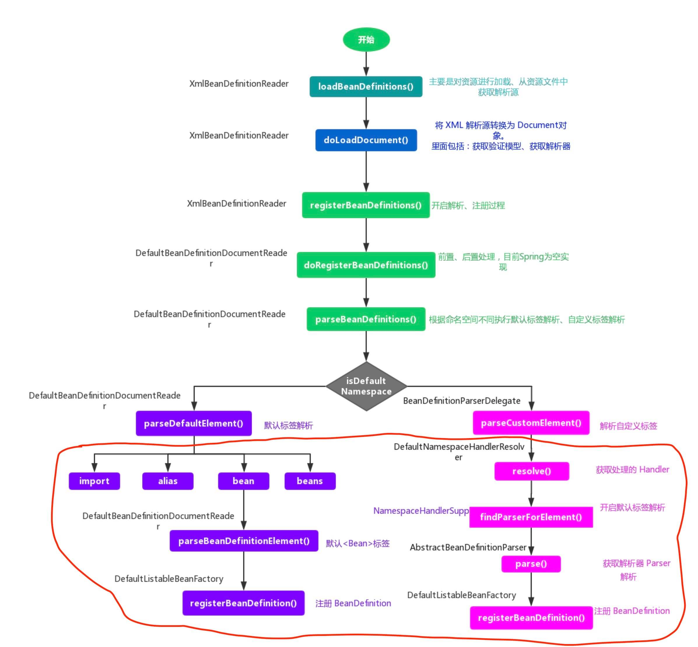
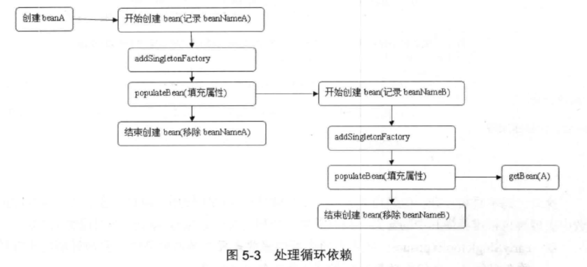
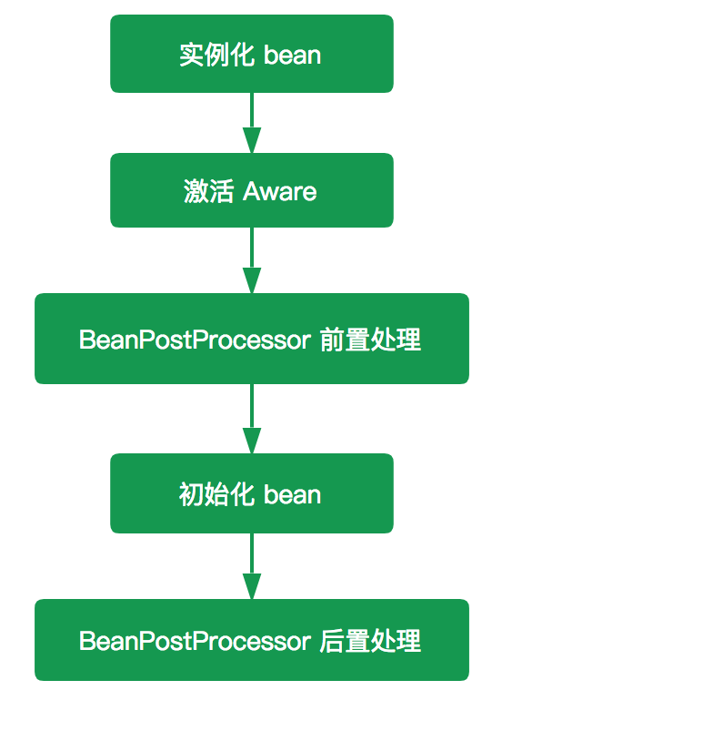
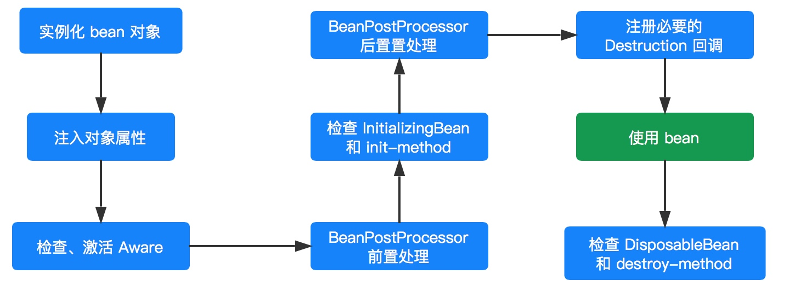

# SPRING 源码阅读笔记

## Spring 资源加载过程简要总结：

Spring 提供了 `Resource` 和 `ResourceLoader` 来统一抽象整个资源及其定位。使得资源与资源的定位有了一个更加清晰的界限，并且提供了合适的 Default 类，使得自定义实现更加方便和清晰。

`AbstractResource` 为 Resource 的默认抽象实现，它对 Resource 接口做了一个统一的实现，子类继承该类后只需要覆盖相应的方法即可，同时对于自定义的 Resource 我们也是继承该类。

`DefaultResourceLoader` 同样也是 `ResourceLoader` 的默认实现，在自定 `ResourceLoader` 的时候我们除了可以继承该类外还可以实现 `ProtocolResolver` 接口来实现自定资源加载协议。

`DefaultResourceLoader` 每次只能返回单一的资源，所以 Spring 针对这个提供了另外一个接口 `ResourcePatternResolver` ，该接口提供了根据指定的 locationPattern 返回多个资源的策略。
其子类 `PathMatchingResourcePatternResolver` 是一个集大成者的 `ResourceLoader` ，不仅实现了 `Resource getResource(String location)` 方法，也实现了 `Resource[] getResources(String locationPattern) `方法

## BeanDefinition 的解析过程
`doLoadBeanDefinitions(InputSource inputSource, Resource resource)` 方法整体时序图

红框部分，就是 BeanDefinition 的解析过程

## 加载 bean 阶段
Spring IoC 容器会以某种方式加载 Configuration Metadata，将其解析注册到容器内部，然后回根据这些信息绑定整个系统的对象，最终组装成一个可用的基于轻量级容器的应用系统。

Spring 在实现中将整个流程分为两个阶段：容器初始化阶段 和 加载 bean 阶段。分别如下：

### 容器初始化阶段：

1. 通过某种方式加载 Configuration Metadata (主要是依据 Resource、ResourceLoader 两个体系) 。
2. 容器会对加载的 Configuration MetaData 进行解析和分析，并将分析的信息组装成 BeanDefinition 。
3. 将 BeanDefinition 保存注册到相应的 BeanDefinitionRegistry 中。

至此，Spring IoC 的初始化工作完成

### 加载 Bean 阶段：

经过容器初始化阶段后，应用程序中定义的 bean 信息已经全部加载到系统中了，当我们显示或者隐式地调用 `BeanFactory#getBean(...)` 方法时，则会触发加载 Bean 阶段

在这阶段，容器会首先检查所请求的对象是否已经初始化完成了，如果没有，则会根据注册的 Bean 信息实例化请求的对象，并为其注册依赖，然后将其返回给请求方

至此第二个阶段也已经完成

## 循环依赖
描述下 Spring 解决循环依赖的过程：

首先 A 完成初始化第一步并将自己提前曝光出来（通过 ObjectFactory 将自己提前曝光）， 在 A 初始化的时候，发现自己依赖对象 B，此时就会去尝试 get(B)，这个时候发现 B 还没有被创建出来

然后 B 就走创建流程，在 B 初始化的时候，同样发现自己依赖 C，C 也没有被创建出来

这个时候 C 又开始初始化进程，但是在初始化的过程中发现自己依赖 A，于是尝试 get(A)
这个时候由于 A 已经添加至缓存中（一般都是添加至三级缓存 singletonFactories ），通过 ObjectFactory 提前曝光，所以可以通过 ObjectFactory#getObject() 方法来拿到 A 对象，
C 拿到 A 对象后顺利完成初始化，然后将自己添加到一级缓存中

回到 B ，B 也可以拿到 C 对象，完成初始化

A 可以顺利拿到 B 完成初始化。

到这里整个初始化过程就已经完成了

Spring解决循环依赖的核心思想在于提前曝光：

1. 通过构建函数创建A对象（A对象是半成品，还没注入属性和调用init方法）
2. A对象需要注入B对象，发现缓存里还没有B对象，将半成品对象A放入半成品缓存
3. 通过构建函数创建B对象（B对象是半成品，还没注入属性和调用init方法）
4. B对象需要注入A对象，从半成品缓存里取到半成品对象A
5. B对象继续注入其他属性和初始化，之后将完成品B对象放入完成品缓存 
6. A对象继续注入属性，从完成品缓存中取到完成品B对象并注入。
7. A对象继续注入其他属性和初始化，之后将完成品A对象放入完成品缓存

| 缓存                     | 说明                                                    |
|------------------------|-------------------------------------------------------|
| singletonObjects	      | 第一级缓存，存放可用的成品Bean。                                    |
| earlySingletonObjects	 | 第二级缓存，存放半成品的Bean，半成品的Bean是已创建对象，但是未注入属性和初始化。用以解决循环依赖。 |
| singletonFactories	    | 第三级缓存，存的是Bean工厂对象，用来生成半成品的Bean并放入到二级缓存中。用以解决循环依赖。     |

### 为什么要包装一层ObjectFactory对象？

如果创建的Bean有对应的代理，那其他对象注入时，注入的应该是对应的代理对象；但是Spring无法提前知道这个对象是不是有循环依赖的情况，而正常情况下（没有循环依赖情况），Spring都是在创建好完成品Bean之后才创建对应的代理。这时候Spring有两个选择：

1. 不管有没有循环依赖，都提前创建好代理对象，并将代理对象放入缓存，出现循环依赖时，其他对象直接就可以取到代理对象并注入。
2. 不提前创建好代理对象，在出现循环依赖被其他对象注入时，才实时生成代理对象。这样在没有循环依赖的情况下，Bean就可以按着Spring设计原则的步骤来创建。

Spring 选择了第二种方式，那怎么做到提前曝光对象而又不生成代理呢？

Spring 就是在对象外面包一层ObjectFactory，提前曝光的是ObjectFactory对象，在被注入时才在`ObjectFactory.getObject`方式内实时生成代理对象，并将生成好的代理对象放入到第二级缓存`Map<String, Object> earlySingletonObjects`

`addSingletonFactory(beanName, () -> getEarlyBeanReference(beanName, mbd, bean));`

### 为什么 Spring 不选择二级缓存方式，而是要额外加一层缓存？

如果要使用二级缓存解决循环依赖，意味着Bean在构造完后就创建代理对象，这样违背了Spring设计原则(延迟实例化)。

Spring 结合 AOP 跟 Bean 的生命周期，是在 Bean 创建完全之后通过`AnnotationAwareAspectJAutoProxyCreator`这个后置处理器来完成的

在这个后置处理的 `postProcessAfterInitialization` 方法中对初始化后的 Bean 完成 AOP 代理。

如果出现了循环依赖，那没有办法，只有给 Bean 先创建代理，但是没有出现循环依赖的情况下，设计之初就是让 Bean 在生命周期的最后一步完成代理而不是在实例化后就立马完成代理。

## Aware 接口
Aware 真正的含义是什么？ 感知

Spring 在初始化主动检测当前 bean 是否实现了 Aware 接口，如果实现了则回调其 set 方法将相应的参数设置给该 bean ，这个时候该 bean 就从 Spring 容器中取得相应的资源

部分常用的 Aware 子接口：

| class                          | desc                            |
|--------------------------------|---------------------------------|
| LoadTimeWeaverAware            | 加载Spring Bean时织入第三方模块，如 AspectJ |
| BeanClassLoaderAware           | 加载Spring Bean的类加载器              |
| BootstrapContextAware          | 资源适配器BootstrapContext，如 JCA,CCI |
| ResourceLoaderAware            | 底层访问资源的加载器                      |
| BeanFactoryAware               | 声明BeanFactory                   |
| PortletConfigAware             | PortletConfig                   |
| PortletContextAware            | PortletContext                  |
| ServletConfigAware             | ServletConfig                   |
| ServletContextAware            | ServletContext                  |
| MessageSourceAware             | 国际化                             |
| ApplicationEventPublisherAware | 应用事件                            |
| NotificationPublisherAware     | JMX通知                           |
| BeanNameAware                  | 声明Spring Bean的名字                |

## BeanPostProcessor 

`BeanPostProcessor` 可以理解为是 Spring 的一个工厂钩子（其实 Spring 提供一系列的钩子，如 `Aware` 、`InitializingBean`、`DisposableBean`），

是 Spring 提供的对象实例化阶段的扩展点，允许 Spring 在实例化 bean 阶段对其进行定制化修改

比较常见的使用场景是处理标记接口实现类或者为当前对象提供代理实现（例如 AOP）

一般普通的 `BeanFactory` 是不支持自动注册 `BeanPostProcessor` 的，需要手动调用 `#addBeanPostProcessor(BeanPostProcessor beanPostProcessor)` 方法进行注册

`BeanPostProcessor` 的作用域是容器级别的，它只和所在的容器相关 ，当 `BeanPostProcessor` 完成注册后，它会应用于所有跟它在同一个容器内的 bean

`ApplicationContext` 可以在其 bean 定义中自动检测所有的 `BeanPostProcessor` 并自动完成注册，同时将他们应用到随后创建的任何 Bean 中。

`#postProcessBeforeInitialization(Object bean, String beanName)` 和 `#postProcessAfterInitialization(Object bean, String beanName)` 两个方法，都接收一个 Object 类型的 bean ，是已经实例化了的 instanceBean，一个 String 类型的 beanName 

这两个方法是初始化 bean 的前后置处理器，他们应用 `#invokeInitMethods(String beanName, final Object bean, RootBeanDefinition mbd)` 方法的前后

`BeanFactory` 和 `ApplicationContext` 对 `BeanPostProcessor` 的处理不同

- `ApplicationContext` 会自动检测所有实现了 `BeanPostProcessor` 接口的 bean，并完成注册

- `BeanFactory` 容器时则需要手动调用 `AbstractBeanFactory#addBeanPostProcessor(BeanPostProcessor beanPostProcessor)` 方法来完成注册

`ApplicationContext` 的 `BeanPostProcessor` 支持 Ordered，而 `BeanFactory` 的 `BeanPostProcessor` 是不支持的

原因在于 `ApplicationContext` 会对 `BeanPostProcessor` 进行 Ordered 检测并完成排序，而 `BeanFactory` 中的 `BeanPostProcessor` 只跟注册的顺序有关

## InitializingBean

Spring 在完成实例化后，设置完所有属性，进行 “`Aware` 接口” 和 “`BeanPostProcessor` 前置处理”后，会检测当前 bean 对象是否实现 `InitializingBean` 接口

如果是，则会调用其 `#afterPropertiesSet()` 方法，进一步调整 bean 实例对象的状态

通过 init-method 可以使用业务对象中定义的任何方法来实现 bean 实例对象的初始化定制化，而不再受制于 `InitializingBean#afterPropertiesSet()` 方法

同时可以使用 <beans> 标签的 `default-init-method` 属性来统一指定初始化方法，这样就省了需要在每个 <bean> 标签中都设置 init-method 这样的繁琐工作

比如在 default-init-method 规定所有初始化操作全部以 initBean() 命名

## Bean 的生命周期

Spring 并不是一启动容器就开启 bean 的实例化进程，只有当客户端通过显示或者隐式的方式调用 BeanFactory 的 `#getBean(...)` 方法来请求某个实例对象的时候，它才会触发相应 bean 的实例化进程

也可以选择直接使用 `ApplicationContext` 容器，因为该容器启动的时候会立刻调用注册到该容器所有 bean 定义的实例化方法。当然，对于 BeanFactory 容器而言，并不是所有的 `#getBean(...)` 方法都会触发实例化进程，比如 singleton 类型的 bean，该类型的 bean 只会在第一次调用 `getBean()` 的时候才会触发，而后续的调用则会直接返回容器缓存中的实例对象。

#getBean(...) 方法，只是 bean 实例化进程的入口，真正的实现逻辑其实是在 AbstractAutowireCapableBeanFactory 的 #doCreateBean(...) 中实现，实例化过程如下图

### bean 实例化
在 `#doCreateBean(...)` 方法中，首先进行 bean 实例化工作，主要由 `#createBeanInstance(...)` 方法实现，该方法返回一个 `BeanWrapper` 对象

BeanWrapper 对象是 Spring 的一个低级 Bean 基础结构的核心接口，为什么说是低级呢？因为这个时候的 Bean 还不能够被我们使用，连最基本的属性都没有设置。而且在我们实际开发过程中，一般都不会直接使用该类，而是通过 BeanFactory 隐式使用

`BeanWrapper` 接口有一个默认实现类 `BeanWrapperImpl` ，其主要作用是对 Bean 进行“包裹”，然后对这个包裹的 bean 进行操作，比如后续注入 bean 属性

在实例化 bean 过程中，Spring 采用“策略模式”来决定采用哪种方式来实例化 bean，一般有反射和 CGLIB 动态字节码两种方式。

`InstantiationStrategy` 定义了 Bean 实例化策略的抽象接口，其子类 `SimpleInstantiationStrategy` 提供了基于反射来实例化对象的功能，但是不支持方法注入方式的对象实例化。

`CglibSubclassingInstantiationStrategy` 继承 `SimpleInstantiationStrategy`，他除了拥有父类以反射实例化对象的功能外，还提供了通过 CGLIB 的动态字节码的功能进而支持方法注入所需的对象实例化需求

默认情况下，Spring 采用 `CglibSubclassingInstantiationStrategy`

### 激活 Aware
当 Spring 完成 bean 对象实例化并且设置完相关属性和依赖后，则会开始 bean 的初始化进程 `#initializeBean(...)` ，初始化第一个阶段是检查当前 bean 对象是否实现了一系列以 Aware 结尾的的接口

Aware 接口为 Spring 容器的核心接口，是一个具有标识作用的超级接口，实现了该接口的 bean 是具有被 Spring 容器通知的能力，通知的方式是采用回调的方式

在初始化阶段主要是感知 `BeanNameAware`、`BeanClassLoaderAware`、`BeanFactoryAware`

### BeanPostProcessor
初始化第二个阶段则是 `BeanPostProcessor` 增强处理，在该阶段 `BeanPostProcessor` 会处理当前容器内所有符合条件的实例化后的 bean 对象。它主要是对 Spring 容器提供的 bean 实例对象进行有效的扩展，允许 Spring 在初始化 bean 阶段对其进行定制化修改，如处理标记接口或者为其提供代理实现。

BeanPostProcessor 接口提供了两个方法，在不同的时机执行，分别对应前置处理和后置处理

### InitializingBean 和 init-method

`InitializingBean` 是一个接口，它为 Spring Bean 的初始化提供了一种方式，它有一个 `#afterPropertiesSet()` 方法，在 bean 的初始化进程中会判断当前 bean 是否实现了 `InitializingBean`，如果实现了则调用 `#afterPropertiesSet()` 方法，进行初始化工作。然后再检查是否也指定了 `init-method` ，如果指定了则通过反射机制调用指定的 init-method 方法

对于 Spring 而言，虽然上面两种方式都可以实现初始化定制化，但是 **更加推崇 `init-method` 方式** ，因为对于 `InitializingBean` 接口而言，他需要 bean 去实现接口，这样就会污染应用程序，显得 Spring 具有一定的侵入性

但是由于 init-method 是采用反射的方式，所以执行效率上相对于 InitializingBean 接口回调的方式可能会低一些

### DisposableBean 和 destroy-method
与 `InitializingBean` 和 `init-method` 用于对象的自定义初始化工作相似，`DisposableBean` 和 `destroy-method` 则用于对象的自定义销毁工作。

当一个 bean 对象经历了实例化、设置属性、初始化阶段，那么该 bean 对象就可以供容器使用了（调用的过程）

当完成调用后，如果是 singleton 类型的 bean ，则会看当前 bean 是否应实现了 `DisposableBean` 接口或者配置了 `destroy-method` 属性，如果是的话，则会为该实例注册一个用于对象销毁的回调方法，便于在这些 singleton 类型的 bean 对象销毁之前执行销毁逻辑

但是，并不是对象完成调用后就会立刻执行销毁方法，因为这个时候 Spring 容器还处于运行阶段，只有当 Spring 容器关闭的时候才会去调用。但是， Spring 容器不会这么聪明会自动去调用这些销毁方法，而是需要我们主动去告知 Spring 容器

对于 `BeanFactory` 容器而言，我们需要主动调用 `#destroySingletons()` 方法，通知 `BeanFactory` 容器去执行相应的销毁方法
对于 `ApplicationContext` 容器而言，调用 `#registerShutdownHook()` 方法

Spring Bean 的生命周期过程总结（方法级别）：

1. Spring 容器根据实例化策略对 Bean 进行实例化
2. 实例化完成后，如果该 bean 设置了一些属性的话，则利用 set 方法设置一些属性
3. 如果该 Bean 实现了 `BeanNameAware` 接口，则调用 `#setBeanName(String beanName)` 方法
4. 如果该 bean 实现了 `BeanClassLoaderAware` 接口，则调用 `setBeanClassLoader(ClassLoader classLoader)` 方法
5. 如果该 bean 实现了 `BeanFactoryAware接口`，则调用 `setBeanFactory(BeanFactory beanFactory)` 方法
6. 如果该容器注册了 `BeanPostProcessor`，则会调用 `#postProcessBeforeInitialization(Object bean, String beanName)` 方法,完成 bean 前置处理
7. 如果该 bean 实现了 `InitializingBean` 接口，则调用 `#afterPropertiesSet()` 方法
8. 如果该 bean 配置了 `init-method` 方法，则调用其指定的方法
9. 初始化完成后，如果该容器注册了 `BeanPostProcessor` 则会调用 `#postProcessAfterInitialization(Object bean, String beanName)` 方法,完成 bean 的后置处理
10. 对象完成初始化，开始方法调用
11. 在容器进行关闭之前，如果该 bean 实现了 `DisposableBean` 接口，则调用 `#destroy()` 方法
12. 在容器进行关闭之前，如果该 bean 配置了 `destroy`-method ，则调用其指定的方法

到这里一个 bean 也就完成了它的一生